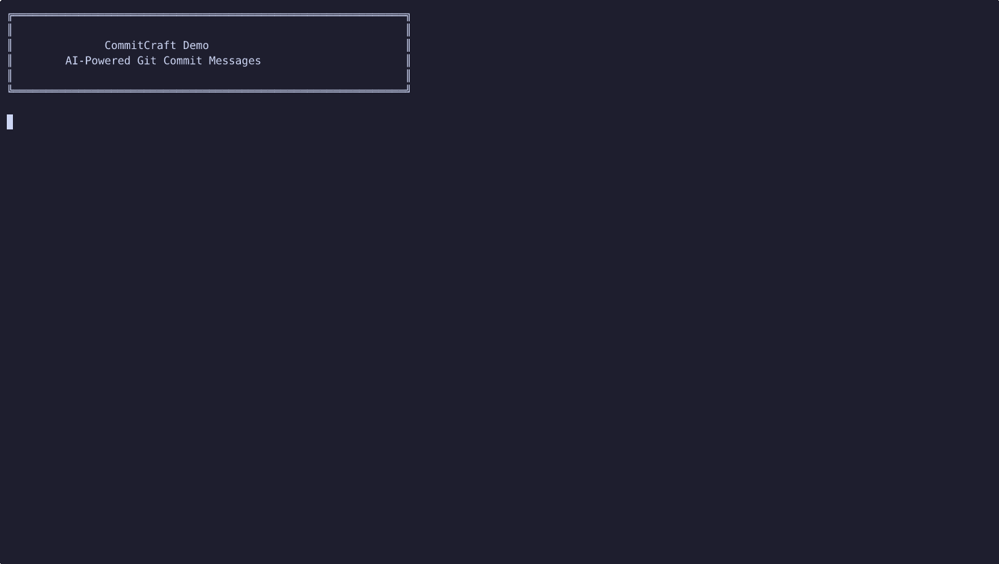

 # CommitCraft

 
[](https://pypi.org/project/commitcraft/)

[](https://www.gnu.org/licenses/agpl-3.0)
[](https://felix-pedro.github.io/CommitCraft/)


[](https://asciinema.org/a/SU2gpwni7jcAnxwd)

CommitCraft is a tool designed to enhance your commit messages by leveraging Large Language Models (LLMs). It provides an intuitive interface that simplifies the process of generating better, more informative commit messages based on staged changes in your git repository.

**Doesn't every code editor, CLI, git helper and toaster have this feature?**

Well, yeah. But CommitCraft is built specifically for **git CLI users**, focusing on features useful to them. It's designed to be as customizable as possible while providing sensible defaults. It might not be unique, but it is certainly opinionated. Do as you wish with it.

## Features

- **Provider Agnostic**: Supports multiple LLM providers including Ollama, Ollama Cloud, Google, OpenAI, Groq, and any OpenAI-compatible endpoint.
- **Git Hook Integration**: Automatically generate commit messages via git hooks - works locally or globally across all repositories.
- **Interactive Configuration**: User-friendly wizard (`CommitCraft config`) to set up providers, models, and preferences.
- **Hierarchical Configuration**: Global configuration for user-wide defaults, project-specific overrides, and CLI arguments.
- **CommitClues**: Provide context clues (bug fixes, features, docs, refactoring) to help the AI generate more accurate messages.
- **Intelligent Context Size**: Automatically adjusts Ollama context size using accurate token counting (via `tiktoken`) for optimal performance and memory usage.
- **Emoji Support**: Option to include emojis in your commit messages based on predefined conventions. Pre-configured with gitmoji specification.
- **Smart Ignore Patterns**: Default ignore patterns for lock files, minified assets, and generated code - automatically excludes noise from diff analysis.
- **Generate Ignore File**: Quick command (`CommitCraft config --generate-ignore`) to create a customizable `.commitcraft/.ignore` file.
- **User-Friendly CLI**: A command-line interface with colorful help messages and easy-to-use options.
- **Debug Mode**: Inspect prompts before sending to the LLM with `--debug-prompt`.
- **Hook Control**: Skip hooks temporarily with `COMMITCRAFT_SKIP=1`, interactive skip option, or automatic skip when using `-m` flag.
- **Customizable**: Allows to easily setup a personalized system prompt and contextual information for tuning your results to your project commit guidelines.

## Installation

You can install CommitCraft using `uv` (recommended) or `pipx`:

```bash
# Using uv (recommended)
uv tool install commitcraft

# Using pipx
pipx install commitcraft
```

The installation includes all supported providers (Ollama, OpenAI, Groq, and Google) and the `tiktoken` library for accurate context size calculation.

**Note:** CommitCraft has migrated from Poetry to `uv` for dependency management. Development now uses `uv sync` and `uv run` commands.

## Updating CommitCraft

### Automatic Update Notifications

CommitCraft automatically checks for updates weekly (opt-out by default) to help you stay current with security patches and new features. When a new version is available, you'll see a notification after generating commit messages or when managing hooks.

**To disable automatic checks**, add this to your config file:
```toml
[updates]
check_enabled = false
```

You can also configure the check interval (in days):
```toml
[updates]
check_enabled = true
check_interval_days = 14  # Check every 2 weeks
```

### Manual Updates

To update CommitCraft to the latest version:

```bash
# Using uv (recommended)
uv tool upgrade commitcraft

# Using pipx
pipx upgrade commitcraft
```

**Check your installed version:**
```bash
CommitCraft --version
```

**Notes:**
- `uv tool upgrade` respects version constraints from the original installation
- To force a specific version: `uv tool install commitcraft==<version>` or `pipx install commitcraft==<version> --force`
- After updating, if you have git hooks installed, update them by running the same hook installation command (e.g., `CommitCraft hook` or `CommitCraft hook --global`)

## Quick Start

### Interactive Configuration (Recommended)

The easiest way to get started is with the interactive configuration wizard:

```bash
CommitCraft config
```

This will guide you through:
- Choosing between **global** (user-wide) or **project** (repository-specific) configuration
- Selecting your LLM provider and model
- Setting up API keys (securely stored in `.env` files)
- Configuring emoji conventions and project context

### Git Hook Integration

Set up automatic commit message generation with git hooks:

```bash
# Install hook for current repository (interactive mode - default)
CommitCraft hook
```
```bash
# Install hook globally for all new repositories
CommitCraft hook --global
```
```bash
# Install in non-interactive mode (no prompts for clues)/ go straight to the message
CommitCraft hook --no-interactive
```
```bash
# Install with confirm (token count before confirming the message generation)
CommitCraft hook --confirm
```
```bash
# Remove the hook (local)
CommitCraft unhook
# Or equivalently: CommitCraft hook --uninstall
```
```bash
# Remove global hook
CommitCraft unhook --global
```

#### Hook Modes

**Interactive Mode (Default):**
When you run `git commit`, the hook will prompt you:
1. **Commit type**: Bug fix, Feature, Documentation, Refactoring, or None
2. **Optional description**: Provide additional context for better commit messages
3. **Skip option**: Choose to skip AI generation and write the message manually

This allows you to use **CommitClues** directly within the hook workflow!

**Example workflow:**
```bash
git add .
git commit
# Hook prompts:
# > What type of commit is this?
# > [b] Bug fix
# > [f] Feature
# > [d] Documentation
# > [r] Refactoring
# > [n] None
# You enter: f
# > Describe the feature (optional):
# You enter: Added dark mode toggle
# CommitCraft generates message with --feat-desc "Added dark mode toggle"
```

**Non-Interactive Mode:**
Generates messages automatically without prompts. Useful for automated workflows or if you prefer always editing the message manually.

**Skipping the Hook:**

You can skip the CommitCraft hook in several ways:

1. **Environment Variable**: Set `COMMITCRAFT_SKIP=1` before committing:
   ```bash
   COMMITCRAFT_SKIP=1 git commit
   ```

2. **Interactive Mode**: Choose `[s] Skip (write message manually)` from the interactive menu

3. **Auto-Skip on `-m` Flag**: The hook automatically skips when you provide your own message with `git commit -m "your message"`

**Controlling CommitClue Prompts:**

Override the hook's interactive mode on a per-commit basis using `COMMITCRAFT_CLUE_PROMPT`:

```bash
# Force interactive prompts (even on non-interactive hooks)
COMMITCRAFT_CLUE_PROMPT=1 git commit

# Disable prompts (even on interactive hooks)
COMMITCRAFT_CLUE_PROMPT=0 git commit
```

Once installed, the hook will automatically generate a commit message whenever you run `git commit`. The AI-generated message will be pre-filled in your editor for you to review and edit before finalizing.

**Hook Version Management:**

The git hook includes automatic version checking. If you update CommitCraft and your hook is outdated, you'll see a warning with tailored update instructions:

```
⚠️  CommitCraft hook is outdated (hook: 0.9.0, installed: 1.0.0)
   Update with: CommitCraft hook
```

The update command automatically matches your hook's configuration:
- **Local interactive hook**: `CommitCraft hook`
- **Local non-interactive hook**: `CommitCraft hook --no-interactive`
- **Global interactive hook**: `CommitCraft hook --global`
- **Global non-interactive hook**: `CommitCraft hook --global --no-interactive`

Simply run the suggested command to update your hook to the latest version.

## Configuration

CommitCraft uses a hierarchical configuration system that allows you to set global defaults and override them per-project:

1. **Global Configuration**: `~/.config/commitcraft/` (or platform-specific app directory)
2. **Project Configuration**: `./.commitcraft/` in your repository root
3. **CLI Arguments**: Override both configuration levels

Supported file types are TOML, YAML, and JSON. You can use either:
- A single `config.{toml|yaml|json}` file with all settings
- Separate files: `context.{ext}`, `models.{ext}`, `emoji.{ext}`

Alternatively, you can specify a configuration file path using the `--config-file` argument.

Your API keys should be stored in environment variables or in a `.env` file (CommitCraft will look for `CommitCraft.env` or `.env`).

## Usage

To use CommitCraft, simply run:

```bash
CommitCraft
```

If no arguments are provided, then the configuration files (if present) will be used to determine settings such as provider, model, and other options. If there are no configuration files, the tool will fall back to using default settings (ollama, gemma2).

The diff used by CommitCraft is the result of `git diff --staged -M` so you will need to add files you want to consider before using it.

You may pipe the output to other commands.

### Command-Line Arguments

#### Model Configuration
- `--provider`: Specifies the LLM provider (e.g., `ollama`, `ollama_cloud`, `google`, `anthropic`, `openai`, `groq`, `openai_compatible`).
- `--model`: The name of the model to use.
- `--config-file`: Path to a configuration file.
- `--system-prompt`: A system prompt to guide the LLM.
- `--num-ctx`: Context size for the model.
- `--temperature`: Temperature setting for the model (0.0 to 1.0).
- `--max-tokens`: Maximum number of tokens for the model.
- `--host`: HTTP or HTTPS host for the provider (required for `openai_compatible`, optional for `ollama`).
- `--show-thinking`: Display model's thinking process if available (e.g., for DeepSeek).

#### CommitClues (Context Hints)
Give the AI more context about your changes:

- `--bug` / `--bug-desc "description"`: Indicate this commit fixes a bug
- `--feat` / `--feat-desc "description"`: Indicate this commit adds a feature
- `--docs` / `--docs-desc "description"`: Indicate this commit updates documentation
- `--refact` / `--refact-desc "description"`: Indicate this commit refactors code
- `--context-clue "custom hint"`: Provide a custom context clue

**Note:** If you're using the git hook in interactive mode (default), you'll be prompted for these clues automatically. Use these CLI flags when running CommitCraft manually.

#### Other Options
- `--amend`: Generate message for `git commit --amend`
- `--ignore`: Files or patterns to exclude from the diff (comma-separated)
- `--debug-prompt`: Display the prompt without sending it to the LLM (useful for debugging)
- `--no-color` / `-p` / `--plain`: Disable colored output (for piping or scripting)
- `--dry-run` : Return the number of tokens it would use in the current status of the repo (added files) and model / provider
- `--confirm` : run a dry-run summary then ask the user to confirm the request

**Example:**
```bash
# Generate commit message for a bug fix with specific context
CommitCraft --bug-desc "Fixed null pointer in user authentication" --provider ollama --model qwen3

# Use custom provider with specific temperature
CommitCraft --provider openai --model gpt-4 --temperature 0.3 --max-tokens 500

# Use Anthropic Claude
CommitCraft --provider anthropic --model claude-3-5-sonnet-20241022 --temperature 0.5
```

### Example Configuration File

Here's an example configuration file in TOML format:

```toml
[context]
project_name = "MyProject"
project_language = "Python"
project_description = "A project to enhance commit messages."
commit_guidelines = "Ensure each commit is concise and describes the changes clearly."

[models]
provider = "ollama"
model = "qwen3"
system_prompt = "You are a helpful assistant for generating commit messages based on git diff."

[models.options]
num_ctx = 8192
temperature = 0.7
max_tokens = 1000

[emoji]
emoji_steps = "single"  # Options: "single" or false (2-step planned for v1.2)
emoji_convention = "simple"  # Options: "simple", "full", or custom string

# Named provider profiles (optional - allows multiple provider configurations)
[providers.remote_ollama]
provider = "ollama"
model = "qwen3"
host = "https://my-ollama-server.example.com"

[providers.deepseek]
provider = "openai_compatible"
model = "deepseek-chat"
host = "https://api.deepseek.com"

[providers.deepseek.options]
temperature = 0.5
max_tokens = 800
```

#### Ignore Files

CommitCraft now includes **default ignore patterns** to automatically exclude noisy files from commit message analysis. Default patterns include:
- Lock files: `*.lock`, `package-lock.json`, `pnpm-lock.yaml`
- Minified assets: `*.min.js`, `*.min.css`, `*.map`
- Auto-generated files: `*.snap`, `*.pb.go`, `*.pb.js`, `*_generated.*`, `*.d.ts`
- Vector graphics: `*.svg`

You can customize these patterns by creating a `.commitcraft/.ignore` file:

```
# .commitcraft/.ignore
*.lock
package-lock.json
dist/*
*.min.js
```

**Quickly generate an ignore file:**
```bash
# Using the interactive config wizard
CommitCraft config --generate-ignore

# Or the short form
CommitCraft config -i
```

This creates `.commitcraft/.ignore` with default patterns that you can customize.

Or use the `--ignore` flag for one-time exclusions:
```bash
CommitCraft --ignore "*.lock,dist/*"
```

You may want those settings to be 3 different files so for example the provider could be decided on a user-by-user basis, adding the models config file to the `.gitignore` file, but the emoji and context settings may be tracked by git.

### Environment Variables

For API keys and sensitive configuration, CommitCraft uses either a `.env` file in the execution directory or system-wide environment variables.

**Standard Providers:**
```sh
# Ollama (optional - only needed for Ollama Cloud or remote instances)
OLLAMA_HOST=http://localhost:11434
OLLAMA_API_KEY=your-api-key-here  # For Ollama Cloud

# Commercial Providers
OPENAI_API_KEY=sk-your-api-key-here
GROQ_API_KEY=gsk_your-api-key-here
GOOGLE_API_KEY=your-google-api-key

# Custom OpenAI-compatible providers (if not using named profiles)
CUSTOM_API_KEY=your-custom-api-key

# Advanced Configuration (Optional)
# Override automatic context size calculation limits
COMMITCRAFT_MIN_CONTEXT_SIZE=1024
COMMITCRAFT_MAX_CONTEXT_SIZE=128000
```

**Hook Control:**

```sh
# Skip CommitCraft hook
COMMITCRAFT_SKIP=1 git commit
```

```sh
# dry run then confirm
COMMITCRAFT_CONFIRM=1 git commit
```

```sh
# select non default provider and model
COMMITCRAFT_PROVIDER=google COMMITCRAFT_MODEL=gemini-2.5-pro git commit
```

Combine settings as you wish.

**Named Provider Profiles:**

For named providers (configured in `[providers.nickname]` sections), use the pattern `NICKNAME_API_KEY`:

```sh
# For [providers.remote_ollama]
REMOTE_OLLAMA_API_KEY=your-remote-ollama-key

# For [providers.deepseek]
DEEPSEEK_API_KEY=your-deepseek-api-key

# For [providers.litellm]
LITELLM_API_KEY=your-litellm-key
```

The interactive config wizard (`CommitCraft config`) will help you set up these environment variables automatically.

### Provider-Specific Notes

#### Ollama Cloud

CommitCraft supports **Ollama Cloud** with the `ollama_cloud` provider. This connects to Ollama's cloud service at `https://ollama.com` using the chat API:

```bash
# Using CLI
CommitCraft --provider ollama_cloud --model qwen3-coder:480b-cloud

# Or in config file
[models]
provider = "ollama_cloud"
model = "qwen3-coder:480b-cloud"
```

**Requirements:**
- Get your API key from [ollama.com/settings/keys](https://ollama.com/settings/keys)
- Set the environment variable:
```sh
OLLAMA_API_KEY=your-ollama-cloud-key
```

**Note:** Unlike local Ollama, the cloud provider uses the chat API and automatically connects to `https://ollama.com`. The `--host` parameter is not needed for Ollama Cloud.

#### OpenAI-Compatible Providers

The `openai_compatible` provider allows you to use any OpenAI API-compatible service (e.g., DeepSeek, Together AI, LiteLLM, etc.):

```bash
CommitCraft --provider openai_compatible --model deepseek-chat --host https://api.deepseek.com
```

**Note:** In v1.0.0, `custom_openai_compatible` was renamed to `openai_compatible` for consistency.

## Privacy

CommitCraft itself does not log, record or send any information about your usage and project, or any other info. Besides the provider the only other request it makes is to to pypi to check for updates and this can be opt-out.

However, it is important to note that by using CommitCraft, you are agreeing to the terms of the providers you choose, as CommitCraft sends diffs and contextual information to their API. Unless you self-host the application, these providers may still collect your request history and metadata information. For more detailed information about how each provider handles your data, please review their respective privacy policies:

- [Ollama Cloud](https://ollama.com/cloud) 

    >Ollama Cloud FAQ:
    > 
    >**What data is logged in Ollama's cloud?**
    >
    > Ollama does not log prompt or response data.  
    >
    > (Accessed: December 7, 2025)


- [Groq](https://groq.com/privacy-policy/)
- [Google](https://ai.google.dev/gemini-api/terms)
- [OpenAI](https://openai.com/policies/privacy-policy/)
- [Anthropic](https://www.anthropic.com/legal/privacy)

## Pricing

CommitCraft is Free Software - free as in freedom and as in no price attached.

However, if you are not self-hosting your models, it's important to be aware of the pricing structure for the providers you use. Some providers offer free tiers, while others operate on usage-based pricing. For more detailed information about pricing options, please refer to the documentation provided by each provider:

- **Free Tier Available:**
  - [Ollama Cloud](https://ollama.com/pricing) - Free tier available
  - [Groq](https://groq.com/pricing/) - Generous free tier
  - [Google](https://ai.google.dev/pricing) - Free tier with quotas

- **Usage-Based Pricing:**
  - [OpenAI](https://openai.com/api/pricing/) - Pay per token
  - [Anthropic](https://console.anthropic.com/docs/en/about-claude/pricing) - Pay per token

- **Self-Hosted (Free):**
  - Ollama (local) - Completely free when self-hosted

## Troubleshooting

If for some reason a dependency is missing follow these steps:

1. Run the following command

```sh
# If installed with uv
uv tool install commitcraft --with [dependency_name]

# If installed with pipx
pipx inject commitcraft [dependency_name]
```

2. Report the problem to the issues page, also provide the command you used to install.


## License

This project is licensed under the AGPL 3.0 License - see the [LICENSE](https://github.com/Felix-Pedro/CommitCraft/blob/main/LICENSE) file for details.

---

Thank you for using CommitCraft! We hope this tool helps you craft better commit messages effortlessly.
